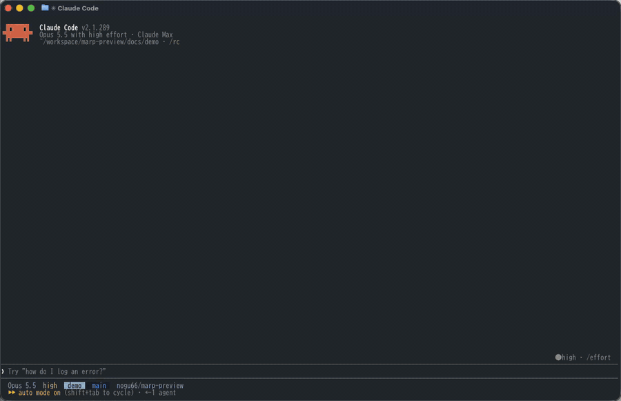

<div align="center">


# marp-preview

Claude Code の pane に Marp スライドのプレビューを表示します。Claude にスライドの修正を頼むと、ターミナルを離れずにその結果を確認できます。




[English](README.md)

</div>

## 必要なもの

| | |
| --- | --- |
| Claude Code | 2.1.289 以降を、端末で使う |
| 端末 | kitty graphics protocol 対応のもの(Ghostty、kitty)。tmux や ssh 経由では表示できません |
| marp-cli | [marp-cli](https://github.com/marp-team/marp-cli) を、プロジェクトかその上位フォルダにインストールしておく(`node_modules/.bin/marp`)。なければ `npx` 経由で実行しますが、起動が遅くなります |

## クイックスタート

1. シェル、またはセッション内でインストールします。

   ```bash
   claude plugin marketplace add nogu66/marp-preview
   claude plugin install marp-preview@marp-preview
   ```

   ```
   /plugin marketplace add nogu66/marp-preview
   /plugin install marp-preview@marp-preview
   ```

2. スライドのあるプロジェクト、またはデッキのあるフォルダで新しいセッションを始め、`/marp` を実行します。

会話の横に pane が開き、デッキの全スライドが縦に並びます。最初のレンダリングは数秒かかり、それ以降は保存から 1〜2 秒で反映されます。

## コマンド

| コマンド | 開くもの |
| --- | --- |
| `/marp` | いまいるフォルダ以下で、いちばん最近更新されたデッキ(`marp: true` のある `.md`)。なければプロジェクト全体から探します。すでにデッキを開いている場合は、そのデッキ |
| `/marp slides/deck.md` | 指定したデッキ。相対パスは、いまいるフォルダからの位置です |
| `/marp slides` | そのフォルダの中で、いちばん最近更新されたデッキ |

## pane の使い方

| やりたいこと | 操作 |
| --- | --- |
| デッキを見ていく | マウスホイールでスクロール。または pane をクリックしてから矢印キーや PageUp / PageDown |
| 最後・最初のスライドへ移動 | 上端の `⏭ Last`、下端の `⏮ First` をクリック |
| キー入力をプロンプトに戻す | Esc |
| プレビューをやめる | pane を閉じる |

**ファイルの変更に追従します。** Claude やエディタがデッキを保存すると、pane が描き直され、変更された最初のスライドまでスクロールします。そのスライドのページ番号は黄色になります。

**読むだけです。** pane がデッキを書き換えることはありません。編集は Claude かエディタで行います。

## テーマと marp-cli

どちらも、デッキの上位フォルダを最大 6 階層まで探します。そのため、Claude Code をプロジェクトのルートで起動しても、デッキのあるフォルダで起動しても同じように動きます。

- **marp-cli:** 上へたどって最初に見つかった `node_modules/.bin/marp` か `marp/node_modules/.bin/marp` を使います。なければ `npx --yes @marp-team/marp-cli` を使います。
- **独自テーマ:** 途中にある `theme/`、`themes/`、`marp/themes/` をすべて `--theme-set` として marp に渡します。テーマの CSS をこのいずれかに置き、デッキの front matter で指定してください(`theme: mine`)。
- **ローカル画像:** スライド内のローカル画像も表示されます。marp は `--allow-local-files` 付きで実行します。

## 仕組み

<details>
<summary>ファイルの保存からプレビュー更新まで</summary>


`/marp` は marp-cli を watch モードで 1 回だけ起動し、そのまま動かし続けます。保存は marp 自身が検知し、開いたままのブラウザで描き直します。ブラウザを起動し直すと数秒かかるところが、約 1 秒で反映されるのはこのためです。hooks module は marp のログを読みます。1 回の変換のログが止まったら、デッキのテキストを最後に表示したものとスライド単位で比較し、描き直して、最初に違いがあったスライドまで pane をスクロールします。PNG は端末がファイル名からディスクを直接読むため、画像データはプラグインを通りません。

**marp の状態を見張ります。** pane を開いている間、1 秒ごとに「marp が動いているか」「保存されたデッキが実際にレンダリングされたか」を確認します。marp が落ちていれば起動し直します。保存から 8 秒たってもレンダリングされない場合は、固まったとみなして終了させ、新しく起動します。何もレンダリングできないまま 3 回続けて終了した場合は、pane にエラーを表示し、次にデッキが保存されるまで待ちます。

**pane と一緒に止まります。** pane を閉じたとき、セッションを終了したとき、別のデッキを開いたとき、プラグインをリロードしたときは、いずれも marp とそのブラウザを終了します。`/clear` では pane が残るので、marp も動かしたままにします。

スライドの数え方は Marp の区切り方と同じです。`---`、`***`、`___` の行が区切りですが、コードフェンスの中、front matter、段落直後の setext 見出しの下線、HTML ブロックの中は区切りません。

| ファイル | 役割 |
| --- | --- |
| [`hooks/register.tsx`](plugins/marp-preview/hooks/register.tsx) | `/marp` コマンド、pane、marp の起動・監視・停止 |
| [`hooks/lib/deck.ts`](plugins/marp-preview/hooks/lib/deck.ts) | 純粋関数: デッキのテキストからスライドへの分割、変更されたスライドの特定 |
| [`types/index.d.ts`](plugins/marp-preview/types/index.d.ts) | プラグインの状態の型 |

各 hook の役割と、プラグインが触れるファイルやプロセスの一覧は、[プラグイン側の README](plugins/marp-preview/README.md) にあります。

</details>

## トラブルシューティング

**`/marp` が unknown command になる。** Claude Code は、信頼済みのワークスペースでしかプラグインの hooks module を読み込まず、読み込まなかった場合も何も表示しません。信頼済みのディレクトリから起動するか、このディレクトリの信頼プロンプトを承認してください。セッションの途中でインストールしたプラグインは、次のセッションから読み込まれます。

**pane が「Rendering the deck…」のまま、または赤い行が出る。** marp-cli が失敗しています。赤い行はエラーの最終行です。全文を見るには `npx @marp-team/marp-cli your-deck.md --images png` を自分で実行してください。

**スライドは出るが、自分のテーマが当たっていない。** marp がテーマを見つけられていません。テーマの CSS は、デッキと同じかそれより上の階層の `theme/`、`themes/`、`marp/themes/` に置く必要があります。

**画像が出ず、代替テキストだけが出る。** 端末が kitty graphics protocol に対応していないか、tmux や ssh を経由しています。

**pane が会話の横ではなく、入力欄の上に開く。** pane が横に並ぶのは、Claude Code をフルスクリーン表示にしていて、端末の幅が 110 桁以上あるときだけです。どちらの配置でも動作は同じです。

## 制約

<details>
<summary>既知の制約</summary>

- function hooks は early access で、Claude Code のリリース間で API が変わることがあります。macOS の Ghostty と 2.1.289 で確認しています。
- 端末専用です。デスクトップアプリ、VS Code 拡張、モバイルアプリではスライドの画像を表示できず、pane にその旨が表示されます。
- `/marp` 直後の最初のレンダリングは、marp がブラウザを起動するため数秒かかります。それ以降は 1〜2 秒です。
- pane を開いている間、marp とそのブラウザが動き続け、数百 MB のメモリを使います。
- 全スライドを一度に描くため、枚数の多いデッキでは pane が長くなります。
- 画像は、縦が横の約 2.1 倍のセルを前提にサイズを決めています。フォントによっては少し伸びて見えます。

</details>

## 更新

```bash
claude plugin marketplace update marp-preview
claude plugin update marp-preview@marp-preview
```

そのあと、新しいセッションを始めてください。バージョンごとの変更点は [changelog](CHANGELOG.md) にあります。

## 開発

```bash
claude --plugin-dir plugins/marp-preview     # このチェックアウトを読み込む。保存でリロード(または bun run dev)
bun test tests                               # 純粋ロジック(または bun run test)
claude plugin test plugins/marp-preview      # pane をエンジンのテストホストで(または bun run test:hooks)
claude plugin validate .                     # マーケットプレイス
claude plugin validate plugins/marp-preview  # プラグイン: どのイベントを hook し、どの `$` を呼ぶか
tsc -p plugins/marp-preview                  # 型チェック(または bun run typecheck)
```

セッションでプラグインを読み込むと(`claude --plugin-dir plugins/marp-preview`、ヘッドレスなら `claude -p "/cost" --plugin-dir plugins/marp-preview`)、その Claude Code ビルドの型宣言と `tsconfig.json` がプラグインの隣に書き出されます。`tsc` にはこれが必要で、`bun run typecheck` は両方を実行します。

デモで使っているデッキは [`docs/demo/deck.md`](docs/demo/deck.md) です。`/marp docs/demo` で開けます。インストール済みのコピーはバージョンが変わったときだけ更新されるので、リリースのたびに `plugins/marp-preview/.claude-plugin/plugin.json` の version を上げてください。

## ライセンス

[MIT](LICENSE)
