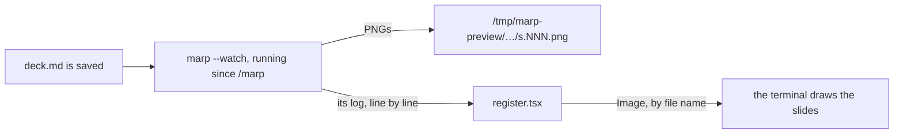

<div align="center">


# marp-preview

A live Marp slide preview in a Claude Code pane. Ask Claude to change a slide and watch it land, without leaving the terminal.


[日本語](README.ja.md)

</div>

## Quick start

You need Claude Code 2.1.289 or later, a terminal that speaks the kitty graphics protocol (Ghostty, kitty), and [marp-cli](https://github.com/marp-team/marp-cli) either in the project (`node_modules/.bin/marp`) or reachable through `npx`.

1. Install, from your shell or inside a session:

   ```bash
   claude plugin marketplace add nogu66/marp-preview
   claude plugin install marp-preview@marp-preview
   ```

   ```
   /plugin marketplace add nogu66/marp-preview
   /plugin install marp-preview@marp-preview
   ```

2. Start a new session in the project that holds your slides, or in the deck's own folder, and run:

   ```
   /marp                  # the most recently changed deck (a .md with `marp: true`) under the folder you are in
   /marp slides/deck.md   # or name one
   /marp slides           # or a folder: the most recently changed deck in it
   ```

```
deck.md 12 slides [ ⏭ Last ]

1 / 12
┌────────────────────────────────┐
│          the first slide         │
└────────────────────────────────┘

2 / 12
┌────────────────────────────────┐
│          the second slide        │
└────────────────────────────────┘
  ⋮
```

## Using it

The pane is the whole deck, one slide under another. Scroll it with the mouse wheel, or click the pane and use the arrow and page keys; Esc gives the keys back to the prompt. `⏭ Last` at the top jumps to the last slide, `⏮ First` at the bottom back to the first.

**It follows the file.** When Claude or your editor saves the deck, the pane renders it again, in a second or two, and scrolls to the first slide that changed, whose page number turns yellow. The pane only reads the deck: editing is Claude's job, or your editor's.

## How it works

<details>
<summary>From a saved file to a new preview</summary>



`/marp` starts marp-cli once, in watch mode, and leaves it running: marp notices a save itself and renders with the browser it already has open, which is why a change shows in about a second rather than the several a fresh browser takes. The hooks module reads marp's log. When a conversion's lines stop, it compares the deck's text with the one it showed last, slide by slide, redraws, and scrolls the pane to the first slide that differs. The terminal reads each PNG from disk by name; no pixel passes through the plugin.

**The watcher is looked after.** Once a second, while the pane is open, the plugin checks that marp is still running and that a saved deck does get rendered. A marp that has died is started again; one that sits on a saved deck for eight seconds is killed and replaced. If marp ends three times in a row without rendering anything, the pane shows its error and waits for the deck's next save before trying again.

**It is stopped with the pane.** Closing the pane, ending the session, opening another deck and reloading the plugin each end marp, and its browser with it. A `/clear` keeps both, as it keeps the pane.

`marp` is taken from the first `node_modules/.bin/marp` (or `marp/node_modules/.bin/marp`) found walking up from the deck, six folders at most, else `npx --yes @marp-team/marp-cli`. Every `theme/`, `themes/` and `marp/themes/` folder on that walk is passed as a `--theme-set`.

Slides are counted the way Marp splits them: a `---`, `***` or `___` line, but not inside a code fence, not the front matter, not a setext underline right under a paragraph, and not inside an HTML block.

| File | Role |
| --- | --- |
| [`hooks/register.tsx`](plugins/marp-preview/hooks/register.tsx) | The `/marp` command, the pane, starting, watching over and stopping marp |
| [`hooks/lib/deck.ts`](plugins/marp-preview/hooks/lib/deck.ts) | Pure: deck text to slides, and which slide a change touched |
| [`types/index.d.ts`](plugins/marp-preview/types/index.d.ts) | The plugin's state contract |

</details>

## Troubleshooting

**`/marp` is an unknown command.** Claude Code loads a plugin's hooks module only in a workspace you have trusted, and stays silent when it does not. Start Claude Code from a directory you have trusted, or accept the trust prompt for this one.

**The pane stays on "Rendering the deck…" or shows a red line.** marp-cli failed; the red line is the last line of its error. Run `npx @marp-team/marp-cli your-deck.md --images png` yourself to see all of it. A custom theme must be in a `theme/` or `themes/` folder at or above the deck.

**No image, only the alt text.** The terminal does not speak the kitty graphics protocol, or sits behind tmux or ssh.

## Limitations

<details>
<summary>Known limits</summary>

- Function hooks are early access, and their API may change between Claude Code releases. Tested on 2.1.289 with Ghostty on macOS.
- The first render after `/marp` takes a few seconds, since marp has to start its browser. Later ones take a second or two.
- While the pane is open, marp and its browser stay running and hold a few hundred megabytes of memory.
- The image is sized for a terminal cell about 2.1 times as tall as it is wide; another font may show it slightly stretched.
- Terminal only. The desktop app, the VS Code extension and the mobile app cannot draw the slide images; the pane says so there.

</details>

## Development

```bash
claude --plugin-dir plugins/marp-preview     # load this checkout; saving reloads it (or: bun run dev)
bun test tests                              # the pure logic (or: bun run test)
claude plugin test plugins/marp-preview      # the pane, in the engine's test host (or: bun run test:hooks)
claude plugin validate .                    # the marketplace
claude plugin validate plugins/marp-preview  # the plugin: which events it hooks, which `$` calls it makes
tsc -p plugins/marp-preview                  # type-check (or: bun run typecheck)
```

Loading the plugin in a session (`claude --plugin-dir plugins/marp-preview`, or `claude -p "/cost" --plugin-dir plugins/marp-preview` for a headless run) writes the type declarations of your Claude Code build and a `tsconfig.json` next to the plugin; `tsc` needs them, and `bun run typecheck` does both. The deck in the demo is [`docs/demo/deck.md`](docs/demo/deck.md). Bump the version in `plugins/marp-preview/.claude-plugin/plugin.json` with each release, since installed copies update only when it changes.

## License

[MIT](LICENSE)
